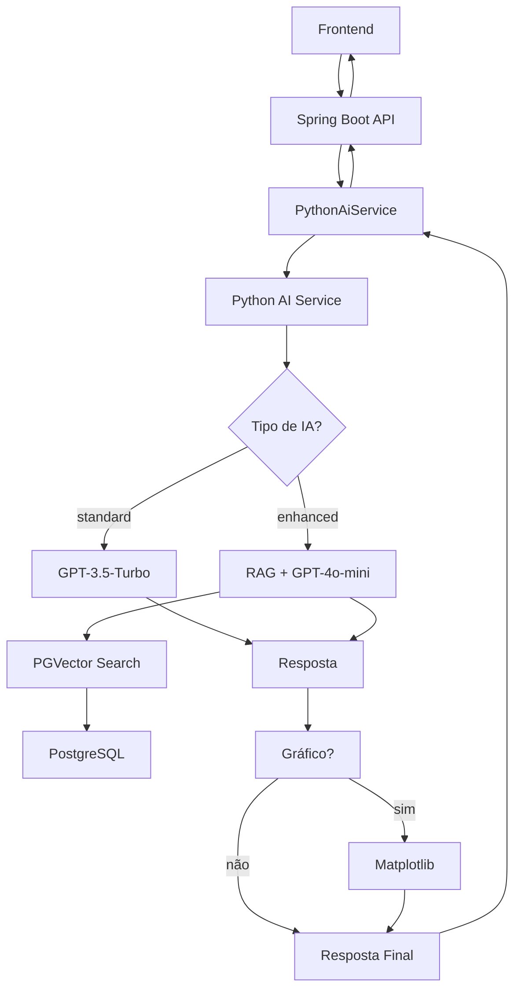

# Migração Completa de IA para Python - GoMech

## Nova Arquitetura

A aplicação GoMech foi **completamente migrada** para processar toda IA no serviço Python. O Spring Boot agora atua apenas como um **API Gateway/Proxy** para o serviço Python.

### ✅ Antes vs Depois

| **Antes (Híbrido)** | **Depois (Tudo em Python)** |
|---------------------|------------------------------|
| Spring AI + Python AI | Apenas Python AI |
| Duas configurações diferentes | Uma configuração unificada |
| Fallback entre sistemas | Sistema único resiliente |
| Dependências Spring AI | Apenas WebClient |

## Componentes Removidos

### ❌ Dependências Removidas do Spring:
- `spring-ai-starter-model-openai`
- `spring-ai-tika-document-reader`
- `spring-ai-starter-vector-store-pgvector`
- `spring-ai-advisors-vector-store`
- Spring AI BOM

### ❌ Serviços Removidos:
- `EnhancedAiService.java`
- Configurações Spring AI

## Nova Estrutura

### 🚀 Serviço Python (`python-ai-service/`)

```
python-ai-service/
├── app.py              # API principal
├── rag_engine.py       # Engine de IA (padrão + aprimorada)
├── requirements.txt    # Dependências Python
├── env.example         # Configurações exemplo
└── .env               # Suas configurações (criar)
```

### 🎯 Serviço Java (Proxy)

```java
// Apenas um serviço simples
@Service
public class PythonAiService {
    // Proxy para Python AI Service
    public AiResponseDTO askQuestion(AiRequestDTO request, String aiType)
}
```

## Tipos de IA Disponíveis

### 1. **IA Padrão** (`ai_type: "standard"`)
- **Modelo**: GPT-3.5-Turbo (mais barato)
- **Processamento**: Direto, sem RAG
- **Uso**: Perguntas simples e gerais
- **Endpoint**: `/ask/standard`

### 2. **IA Aprimorada** (`ai_type: "enhanced"`)
- **Modelo**: GPT-4o-mini
- **Processamento**: RAG com LangChain + PGVector
- **Uso**: Análises complexas, dados específicos
- **Endpoint**: `/ask/enhanced`

## Configuração e Deploy

### 1. Configurar Serviço Python

```bash
cd python-ai-service

# 1. Instalar dependências
pip install -r requirements.txt

# 2. Configurar variáveis (.env)
cp env.example .env
# Editar .env com suas configurações

# 3. Executar serviço
uvicorn app:app --host 0.0.0.0 --port 8000
```

### 2. Configurar Spring Boot

No `application.properties`:
```properties
# URL do serviço Python
PYTHON_AI_SERVICE_URL=http://localhost:8000

# Habilitar serviço
PYTHON_AI_ENABLED=true
```

## API Atualizada

### Request Simplificado
```json
{
  "prompt": "Sua pergunta",
  "includeChart": true,
  "useEnhancedAi": true
}
```

### Response Unificado
```json
{
  "content": "Resposta da IA",
  "status": "success",
  "chart": "base64_image_or_null",
  "aiType": "enhanced|standard",
  "processingTime": 1500
}
```

### Endpoints

#### POST `/ai/chat`
**Descrição**: Endpoint principal - determina automaticamente o tipo de IA
```bash
curl -X POST http://localhost:5080/ai/chat \
  -H "Content-Type: application/json" \
  -d '{
    "prompt": "Análise de vendas do último trimestre",
    "includeChart": true,
    "useEnhancedAi": true
  }'
```

#### GET `/ai/chat/status`
**Descrição**: Status do serviço Python
```json
{
  "pythonAiServiceAvailable": true,
  "standardAiAvailable": true,
  "enhancedAiAvailable": true,
  "status": "available",
  "message": "Python AI Service está funcionando - Ambos os tipos de IA disponíveis"
}
```

## Vantagens da Nova Arquitetura

### 🎯 **Simplicidade**
- **Uma única fonte de IA**: Tudo processado no Python
- **Configuração unificada**: Apenas o serviço Python precisa das chaves de API
- **Manutenção simplificada**: Lógica de IA centralizada

### ⚡ **Performance**
- **Menos overhead**: Spring não processa IA
- **Otimizações Python**: LangChain + LlamaIndex otimizados
- **Conexão direta**: Banco → Python (sem Java intermediário)

### 🛡️ **Resiliência**
- **Sistema único**: Menos pontos de falha
- **Fallback interno**: IA padrão se RAG falhar
- **Timeouts configuráveis**: 3 minutos para processamento complexo

### 💰 **Economia**
- **Modelos otimizados**: GPT-3.5 para padrão, GPT-4o-mini para aprimorada
- **Cache eficiente**: Python pode implementar cache local
- **Processamento inteligente**: RAG apenas quando necessário

## Fluxo de Dados



## Monitoramento

### Logs Importantes
```properties
# Spring Boot
logging.level.com.gomech=DEBUG
logging.level.org.springframework.web.reactive.function.client=DEBUG

# Python (terminal)
uvicorn app:app --log-level info
```

### Métricas Disponíveis
- **Processing Time**: Tempo de processamento em ms
- **AI Type Used**: Qual tipo de IA foi utilizada
- **Service Availability**: Status do serviço Python
- **Error Rates**: Taxa de erros por endpoint

## Troubleshooting

### Problemas Comuns

1. **"Python AI Service não está disponível"**
   - Verificar se o serviço Python está rodando na porta 8000
   - Verificar configuração de `PYTHON_AI_SERVICE_URL`

2. **"Erro na comunicação com Python AI Service"**
   - Verificar conectividade de rede
   - Verificar logs do serviço Python

3. **"Timeout ao processar pergunta"**
   - Perguntas complexas podem demorar até 3 minutos
   - Verificar se o banco PGVector está acessível

4. **Gráficos não aparecem**
   - Verificar se `includeChart: true` no request
   - Verificar instalação do Matplotlib no Python

### Verificação de Saúde
```bash
# Testar serviço Python diretamente
curl http://localhost:8000/

# Testar através do Spring
curl http://localhost:5080/ai/chat/status
```

## Próximos Passos

1. **✅ Implementar cache** no serviço Python para respostas frequentes
2. **✅ Adicionar métricas** detalhadas de uso
3. **✅ Implementar rate limiting** no Python
4. **✅ Adicionar autenticação** entre serviços
5. **✅ Dockerizar** ambos os serviços
6. **✅ Implementar CI/CD** para deploy automático 